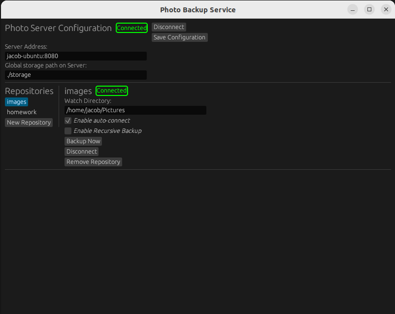

# photo-backup

Simple image/file backup service written in Rust. Client is compatible with android and linux platforms.
This project is intended for educational purposes using distributed systems in Rust. It's also designed to be practical and actually useful since I am tired of paying for google drive.
