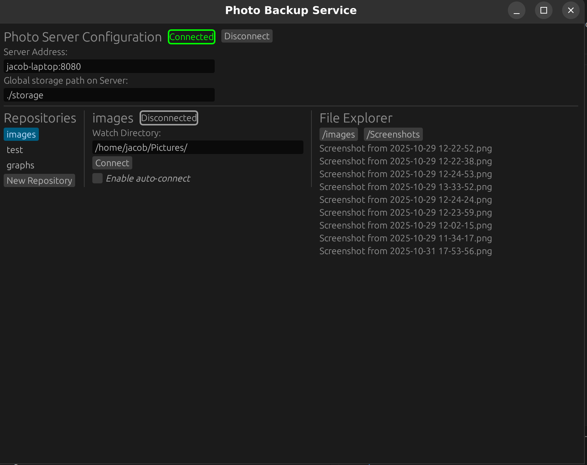

# photo-backup

This is a simple/high-performance image backup service written in Rust which operates on a client/server architecture.
This project is intended for educational purposes using distributed systems in Rust.

# Installation Prerequisites
Make sure you have Rust and the cargo package manager installed on your machine

# Installation Steps (Server)
Clone the Github repo to desired path
`git clone https://github.com/vx59/photo-backup.git`

Navigate to the "photo-server" directory
`cd photo-backup/photo-server`
Compile with `cargo build`
run and build with `cargo run`

# Installation Steps (Client)
Clone the Github repo to desired path
Navigate to the "photo-client" directory
`cd photo-backup/photo-client`
Compile with `cargo build`
run and build with `cargo run`

On the machine running the photo-server you currently need to create your storage directory within the "photo-server" folder.
Upon running the client the user will need to provide `hostname:8080`, by default the server runs on port 8080. You will also need to provide the storage directory relative to the "photo-server" folder. Then server will dispatch a request handler which the client will connect to.

Once connected you will be able to view a list of repositories or create one. Selecting a repository will display a panel to manage the file streaming service. The file explorer allows you to view and navigate the structure of the repository.

All responses from the server are logged in output.log.
At this point it is unsafe to modify any of the .tree files
